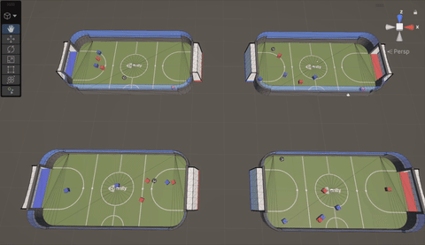

# 🎮 2026 PCUBE × Unity 강화학습 스터디

> Unity ML-Agents로 게임 AI를 밑바닥부터 — **환경 설계 → 학습 → 배포**까지 매주 직접 굴려 보는 판도라큐브 강화학습 스터디

  

<em>week4 · MA-POCA + Self-Play로 학습한 3 vs 3 축구 에이전트</em>

---

## 소개

- Unity ML-Agents를 중심으로 강화학습 파이프라인(**환경 설계 → 학습 → 배포**)을 매주 실습
- RL 이론(DQN·PPO)에서 출발해 다양한 게임 에이전트 학습을 경험

---

## 커리큘럼

| 주차 | 주제 | 핵심 개념 | 문서 · 산출물 | 상태 |
|---|---|---|---|---|
| **week1** | RL 이론 + 셋업 | MDP · 가치함수 · DQN · PPO | [강화학습 기초](week1/이론-강화학습_기초.md) · [DQN](week1/이론-DQN.md) · [PPO](week1/이론-PPO.md) · [ML-Agents 셋업](week1/실습-mlagents_셋업.md) | 완료 |
| **week2** | ML-Agents 개요 · 에이전트 설계 | 관측 · 행동 · 보상 설계 | [ML-Agents 개요](week2/이론-ml_agents_개요.md) · [에이전트 설계](week2/이론-에이전트_설계.md) · `BallDemo` (3D Ball) | 진행  전 |
| **week3** | 단일 에이전트 학습 | 관측 설계 · PPO 학습 루프 | [FoodCollector 학습](week3/food_collector_training.md) · `FoodCollector` | 진행 전 |
| **week4** | 멀티에이전트 축구 | MA-POCA · Self-Play · Curriculum | [Curriculum](week4/Curriculum.md) · [POCA](week4/POCA.md) · [Self-Play](week4/SelfPlay.md) · [SoccerBots](week4/SoccerBots.md) · `SoccerBots` | 진행 전|

---

## 기술 스택

- **엔진**: Unity 6
- **RL 프레임워크**: Unity ML-Agents (`ml-agents 4.0.3`)
- **학습**: Python 3.10 · PyTorch 2.2 · ONNX
- **알고리즘**: PPO · DQN(이론) · MA-POCA · Self-Play
