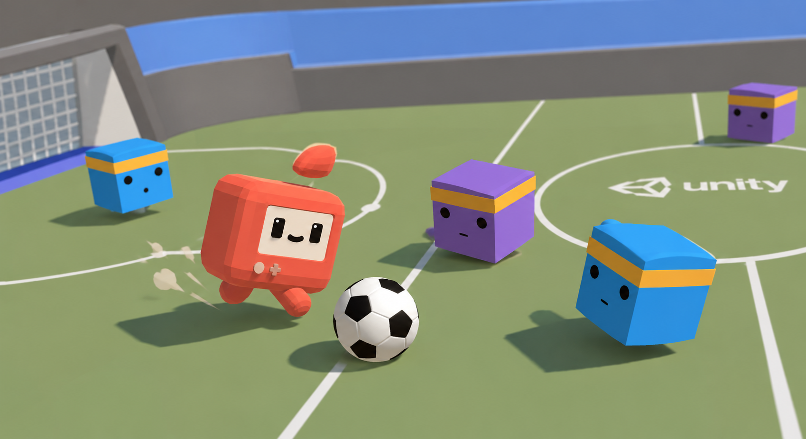
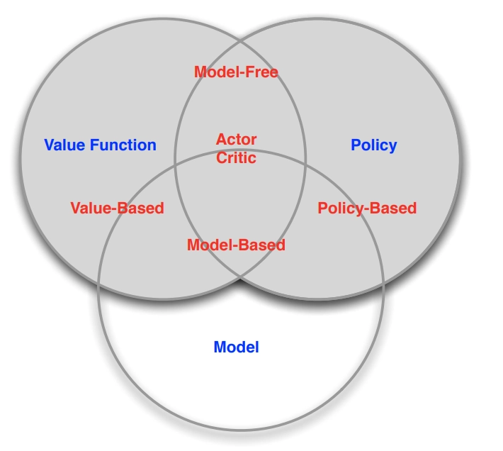
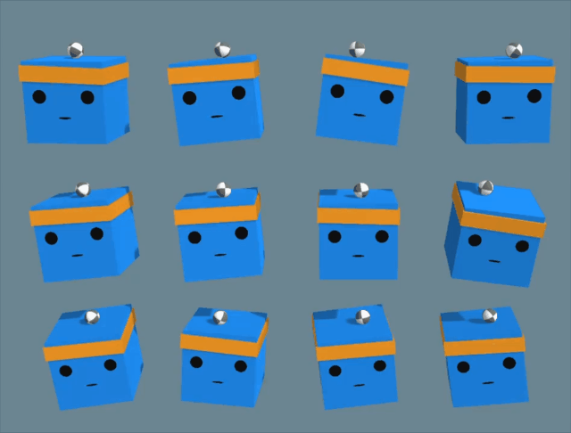
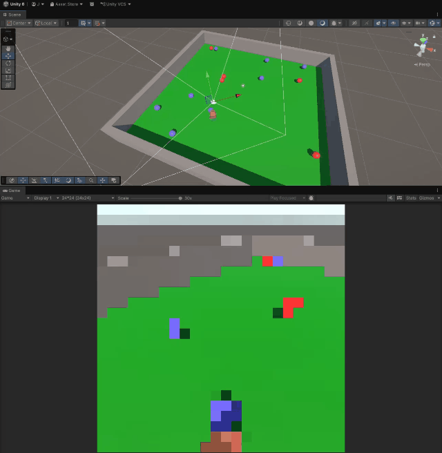
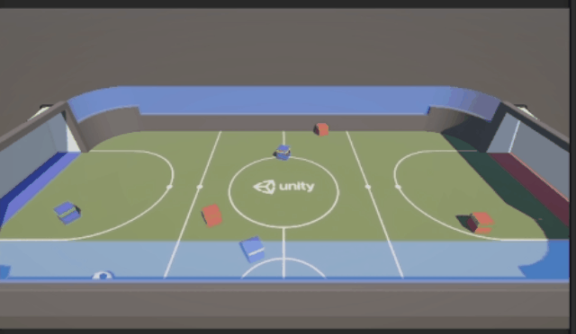
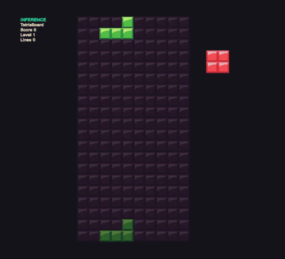
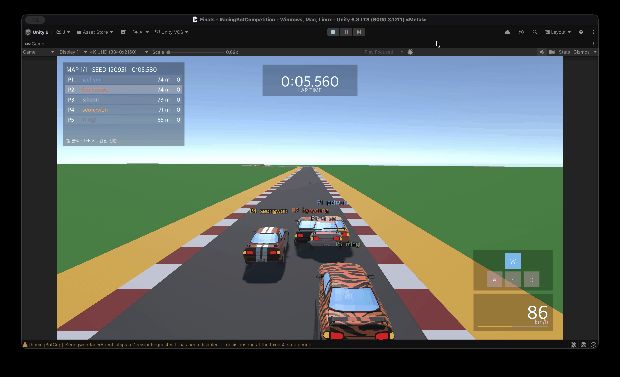

# 🎮 2026 PCUBE × Unity 강화학습 스터디

> Unity ML-Agents로 게임 AI를 밑바닥부터 — 매주 새로운 프로젝트를 진행하는 판도라큐브 강화학습 스터디

<p align="center">
  
  
  
  
</p>


<p align="center">
  
</p>

---

## 소개

- 세종대학교 게임 제작 동아리 **판도라큐브**의 2026년 메인 스터디입니다.
- RL 이론(MDP · DQN · PPO)에서 시작해, 매주 새 게임 환경에 에이전트를 붙여 학습시킵니다.
- 단일 에이전트 → 멀티 에이전트(축구) → off-policy(테트리스) → **대회**(레이싱) → **개인 최종 프로젝트** 순서로 난이도를 올립니다.
- 주차별 폴더에 이론 문서, Unity 프로젝트, 학습 config가 함께 들어 있습니다.

---

## 진행 현황

| 주차 | 주제 | 핵심 개념 | 프로젝트 | 상태 |
|---|---|---|---|---|
| **week1** | RL 이론 + 셋업 | MDP · 가치함수 · DQN · PPO | – | ✅ 완료 |
| **week2** | ML-Agents 개요 · 에이전트 설계 | 관측 · 행동 · 보상 · 에피소드 설계 | `BallDemo` (3D Ball) | ✅ 완료 |
| **week3** | 단일 에이전트 학습 | Ray / Camera 센서 · TensorBoard | `FoodCollector` | ✅ 완료 |
| **week4** | 멀티 에이전트 축구 | MA-POCA · Self-Play · Curriculum | `SoccerBots` | ✅ 완료 |
| **week5** | 테트리스 봇 | SAC · Action Masking · 행동 추상화 | `TetrisAgent` | ✅ 완료 |
| **week6** | 레이싱 대회 | 일반화 · 보상 설계 경쟁 | `RacingBotCompetition` | ✅ 완료 |
| **week7-8** | 최종 프로젝트 | 1인 1환경 설계 → 학습 → 배포 | 개인별 | 🚧 진행 중 |

---

## 주차별 학습 내용

### Week 1 — 강화학습 이론 & ML-Agents 셋업



- **RL 기본**: 에이전트-환경 루프, MDP `⟨S, A, P, R, γ⟩`, 할인율과 리턴, 가치함수(V · Q · Advantage), 벨만 방정식, 탐험 vs 활용
- **알고리즘 분류 3축**: 모델-프리/모델-기반 · 가치/정책/액터-크리틱 · on-policy/off-policy
- **DQN**: Q-러닝 + 신경망. 경험 재생과 타깃 네트워크로 학습을 안정화
- **PPO**: 정책 경사 + 클리핑(`ratio ∈ 1±ε`). ML-Agents가 PPO를 기본 트레이너로 쓰는 이유
- **셋업**: 버전 호환표와 트러블슈팅 정리

📄 [강화학습 기초](week1/이론-강화학습_기초.md) · [DQN](week1/이론-DQN.md) · [PPO](week1/이론-PPO.md) · [ML-Agents 셋업](week1/실습-mlagents_셋업.md)

<br clear="right">

### Week 2 — ML-Agents 개요 & 에이전트 설계

- **구조**: Unity(환경) ↔ gRPC ↔ Python(트레이너). 학습이 끝나면 정책을 `.onnx`로 내보내 Unity에서 혼자 추론
- **Agent 생명주기**: `OnEpisodeBegin` → `CollectObservations` → `OnActionReceived` → `EndEpisode`, Behavior Parameters · Decision Requester
- **설계 원칙**: 관측은 정규화하고 상대좌표로, 행동 공간은 최소로, 보상은 `[-1, 1]` 스케일에 시간 페널티, 리셋할 때 무작위화
- **실습**: 3DBall 예제를 PPO로 학습하고, `environment_parameters`로 공 크기(0.1~2)를 랜덤화
- 
<p align="center">
  
</p>

<!-- TODO(visual): 3DBall 학습 GIF — results/w2/3dball.mp4 를 GIF로 변환해 assets/ 에 추가 -->

📄 [ML-Agents 개요](week2/이론-ml_agents_개요.md) · [에이전트 설계](week2/이론-에이전트_설계.md) · [`ball.yaml`](week2/BallDemo/configs/ball.yaml)

### Week 3 — FoodCollector: 관측 설계

캐릭터가 **고기는 먹고 당근은 피하도록** 학습시킵니다. 키보드로 움직이던 `PlayerController`를 ML-Agents `Agent`로 바꾸는 것부터 시작합니다.

<p align="center">
  
</p>

| | 설계 |
|---|---|
| 관측 | Ray Perception Sensor 3D + 로컬 속도 2 |
| 행동 | 연속 2 (전후진, 회전) |
| 보상 | 고기 +1 · 당근 −1 · 매 스텝 −1/MaxStep |

- ML-Agents 센서 비교: Ray · Camera · Render Texture · Grid · Buffer · Physics
- TensorBoard 지표 읽는 법: Cumulative Reward, Entropy, Policy/Value Loss 등
- **과제**: Ray 센서 대신 **Camera 센서(CNN)** 로 학습. 해상도는 낮추고 고기와 당근 색은 확실히 구분

<!-- TODO(visual): FoodCollector 추론 GIF (results/w3/train_recording.mov 변환) -->
<!-- TODO(visual): 카메라 센서 과제 GIF (results/w3/camera_sensor.mp4 변환) -->

📄 [FoodCollector](week3/FoodCollector.md) · [센서 정리](week3/Sensors.md) · [TensorBoard 읽기](week3/TensorBoard.md)

### Week 4 — SoccerBots: 멀티 에이전트 & 보상 설계

스트라이커 2명과 골키퍼 1명으로 된 **3v3 축구팀**을 MA-POCA + Self-Play + Curriculum으로 학습시킵니다.

<p align="center">
  
</p>

- **정책 분리**: 스트라이커 2명은 `Striker` 정책을 공유하고, 골키퍼는 `Goalie` 정책을 따로 씁니다. Blue/Red 팀에 Team Id 0/1을 줘서 "같은 Behavior Name + 다른 Team Id" 조합으로 self-play를 구성
- **관측/행동**: Ray Perception(공 · 벽 · 자기/상대 골대 · 아군 · 적, Stacked 3) / 이산 `[3, 3, 3]`(전후 · 좌우 · 회전)
- **Credit assignment**: 골 보상을 득점자가 아니라 팀 전체(`AddGroupReward`)에 주고, 기여도 배분은 MA-POCA의 중앙 크리틱에 맡김(중앙 집중 학습, 분산 실행)
- **보상**: 득점 +1 / 실점 −1, 스트라이커와 골키퍼 개별 shaping 보상 적용
- **커리큘럼 3단계**: `EmptyGoal` → `VsGoalie` → `SelfPlay`(3v3). self-play는 제로섬이라 실력은 보상 대신 **ELO**로 확인
- **결과**: 환경 4개로 3~4시간 학습. 사람이 상대하기 어려울 정도의 높은 수준의 성능 달성 . 패스 같은 팀플레이는 아직 부족


📄 [SoccerBots 가이드](week4/SoccerBots.md) · [POCA](week4/POCA.md) · [Self-Play & ELO](week4/SelfPlay.md) · [Curriculum](week4/Curriculum.md)

### Week 5 — TetrisAgent: SAC & 행동 설계

테트리스를 플레이하는 에이전트입니다. 물리 엔진이 없는 퍼즐 환경입니다.



- **행동 추상화**: 키 입력(이동 · 회전 · 드롭)을 학습시키는 대신 "몇 번째 열에 몇 번 회전해서 놓기"를 행동 하나로 정의 → **이산 40개**(10열 × 4회전). T스핀 같은 고급 기술은 못 쓰지만 학습 효율을 얻음
- **Action Masking**: `WriteDiscreteActionMask`로 놓을 수 없는 위치를 매 스텝 차단. 규칙은 마스킹이 맡고 신경망은 전략만 학습
- **관측**: 10×20 보드 점유(0/1) 200개 + 현재 조각 one-hot
- **보상**: 생존 소량 + / 라인 클리어(동시에 지운 줄이 많을수록 가중) / 놓기 전과 후의 구멍 · 평탄도 · 최대 높이 **변화량**에 따른 보상
- **SAC**: off-policy라서 Replay Buffer로 과거 경험을 재사용 → 경우의 수가 많은 퍼즐에서 샘플 효율이 높음. 엔트로피 최대화로 탐험도 유지
- **결과**: 약 900만 스텝(7시간) 학습 → **평균 레벨 22, 200줄 이상 클리어**. 같은 설계를 PPO로 학습하면 보상이 훨씬 느리게 오름

📄 [TetrisAgent 가이드](week5/TetrisAgent.md) · [SAC](week5/이론-SAC.md) · [Action Masking](week5/이론-ActionMasking.md)

<!-- TODO(visual): SAC vs PPO Cumulative Reward 비교 그래프 (5주차 블로그 글의 TensorBoard 캡처) -->

<br clear="right">

### Week 6 — RacingBot Cup 🏁

모두 같은 스펙의 차량으로 **처음 보는 랜덤 트랙**에서 누가 더 빠른 에이전트를 만드는지 겨룬 3주짜리 대회입니다.

- **환경**: 주행 보조가 없는 레이싱 시뮬레이션 + 시드 기반 트랙 생성기(점 배치 → 섹션 분류 → Spline 연결). 직선 · 헤어핀 · 시케인 · S자 · 장애물 직선 · 램프 코너 같은 섹션을 조합
- **규칙**: 차량 스펙과 채점 코드는 고정. **관측 · 센서 · 보상만** 자유롭게 설계. 트랙을 3초 넘게 벗어나면 DNF
- **평가**: 각자 PC에서 공개 시드 10개를 베이스라인 봇(고스트)과 나란히 주행 → `점수 = clamp(봇 기록 / 내 기록, 0, 2)`의 평균
- **실시간 리더보드**: Unity의 [결과 제출] 버튼 → Google Form → Apps Script가 시트에서 자동으로 순위 계산
- **본선 (2026-09-11)**: 처음 공개하는 랜덤 시드 3개 트랙에서 동시에 주행하고, 점수를 합산해 최종 순위 결정

<p align="center">
  
</p>
<p align="center"><em>본선</em></p>

| 최종 순위 | 참가자 | 본선 점수 | 리더보드 총점 | 전략 |
|:---:|---|:---:|:---:|---|
| 🥇 | [최재현](https://github.com/linklingj) | 12 | 1.4458 | 장애물 시드로 완주율부터 1에 가깝게 → 시드별 기록을 기준으로 속도 보상, 총 약 40시간 학습 |
| 🥈 | [이성원](https://github.com/nanen123) | 10 | 1.3235 | 벗어난 바퀴 수의 제곱으로 이탈 벌점 + 구간별 속도 벌점 → 아웃-인-아웃 라인 |
| 🥉 | [안효용](https://github.com/HyoYongAnn) | 10 | 1.2094 | 행동 유도 없이 완주 · 시간 보상만 크게 → 본선 내내 리타이어 없음 |
| 4 | [홍민기](https://github.com/Cleanhea) | 7 | 1.1420 | |
| 5 | [권시헌](https://github.com/ksihun) | 4 | 1.4069 | |

📄 [참가 가이드](week6/CompetitionGuide.md) · [대회 결과](week6/CompetitionResults.md) · [리더보드 운영](week6/leaderboard/README.md) · [`racer_ppo.yaml`](week6/config/racer_ppo.yaml)

### Week 7-8 — 최종 프로젝트 🚧

week3~6에서는 주어진 환경을 다뤘다면, 최종 프로젝트에서는 **1인 1프로젝트로 환경 설계부터 배포까지 직접** 합니다. (~9월 말)


<!-- TODO(visual): 최종 프로젝트 결과 GIF + 프로젝트 목록 표 (완료 후 추가) -->

📄 [최종 프로젝트 안내](week7-8/최종_프로젝트.md)


---

## 기술 스택

- **엔진**: Unity 6 (`6000.3`)
- **RL 프레임워크**: Unity ML-Agents (`com.unity.ml-agents 4.0.3`, week6은 `4.1.0`)
- **학습**: Python 3.10.12 · PyTorch 2.2 · ONNX · TensorBoard
- **알고리즘**: PPO · SAC · MA-POCA · Self-Play · Curriculum Learning (DQN은 이론)

---

## 레포 구조

```
week1/     # RL 이론(기초 · DQN · PPO) + ML-Agents 셋업
week2/     # ML-Agents 개요 · 에이전트 설계 + BallDemo
week3/     # FoodCollector + 센서 · TensorBoard 문서
week4/     # SoccerBots + POCA · Self-Play · Curriculum 문서
week5/     # TetrisAgent + SAC · Action Masking 문서
week6/     # RacingBotCompetition + 대회 가이드 · 결과 · 리더보드
week7-8/   # 최종 프로젝트 안내
assets/    # README 이미지
```

개인 과제는 각자 fork에 보관하고, 공용으로 쓸 것만 PR로 올립니다. 자세한 규칙은 [CONTRIBUTING.md](CONTRIBUTING.md)를 참고하세요.
