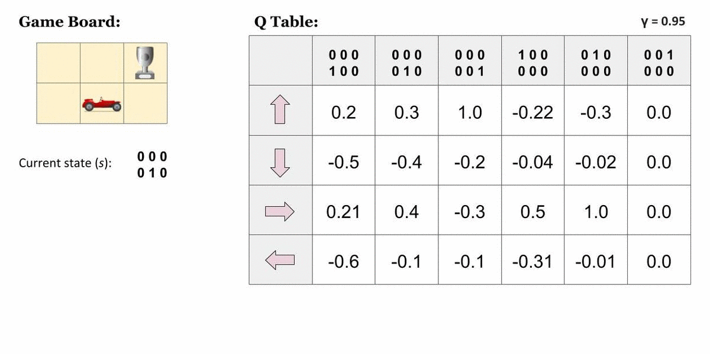
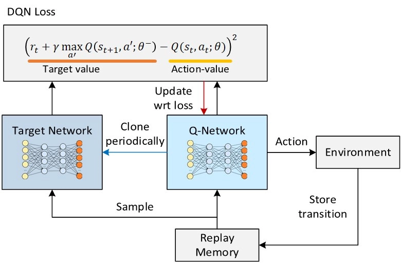

# 이론: DQN

# DQN (Deep Q-Network) 정리

## 1. DQN이란

- **Q-러닝 + 신경망(CNN)**. Q 테이블 대신 신경망으로 Q 함수를 근사해, 화면 픽셀만 보고 아타리 게임 49종을 사람 수준으로 학습했다.
- 2013년 공개, 2015년 Nature 게재. 하나의 알고리즘·구조로 여러 게임을 동일하게 학습시켰다는 점이 충격이었다.
    [유튜브 영상](https://www.youtube.com/watch?v=TmPfTpjtdgg)
- 신경망을 강화학습에 붙이면 학습이 요동치거나 발산하는 게 고질적 문제였는데, DQN은 이를 잠재우는 두 장치(경험 재생, 타깃 네트워크)로 **심층 강화학습(Deep RL)의 문을 열었다.**
  

---

## 2. 출발점: Q 함수와 Q-러닝

- **Q 함수 `Q(s,a)`**: 상태 `s`에서 행동 `a`를 했을 때 앞으로 얼마나 좋은지 나타내는 값. Q를 정확히 알면 정책은 `argmax_a Q(s,a)`로 저절로 나온다.
- **Q-러닝 갱신**:

```
목표값 = r + γ · max_a' Q(s', a')
Q(s,a) ← Q(s,a) + α · (목표값 − Q(s,a))
```

- 다음 상태에서 **최선의 행동을 가정**하고 계산하므로, 실제로 그 행동을 했는지와 무관하게 배울 수 있다 → **off-policy**. 이 성질이 뒤의 경험 재생을 가능케 한다.



---

## 3. Q 테이블의 벽 → 신경망 근사

- 전통적 Q-러닝은 Q 값을 **표**(상태 × 행동)에 적어 관리한다. 상태가 적으면 잘 작동하지만:
    - 화면 픽셀처럼 상태 공간이 사실상 무한하면 표를 만들 수 없다.
    - 표는 칸을 독립적으로 다뤄 **일반화가 안 된다** — 비슷한 화면도 완전히 다른 칸으로 취급.
- **해법**: 표 대신 **신경망으로 Q 함수를 근사**한다. 화면 입력 → 각 행동의 Q 값 출력. 픽셀 입력이므로 **CNN**으로 특징을 뽑고 그 위에서 Q 값을 예측한다.

---

## 4. 왜 불안정해지는가

신경망 근사를 붙이면 학습이 심하게 요동치거나 발산한다. 원인은 두 가지.

| 원인 | 내용 |
| --- | --- |
| **데이터 상관** | 연속된 프레임은 서로 거의 같다. 비슷한 데이터만 연달아 학습하면 현재 국면에 과적합됐다가 상황이 바뀌면 이전 학습을 잊는다(지도학습은 데이터를 섞어 쓰지만 RL 경험은 시간순으로 얽혀 있음). |
| **움직이는 목표** | 목표값 `r + γ·max Q(s',a')` 안에 학습 중인 Q 자신이 들어 있다. Q가 갱신되면 목표값도 같이 움직여, 목표를 쫓아가면 목표가 도망가는 상황이 된다. |

DQN의 핵심 기여는 이 두 문제를 각각 겨냥한 장치를 도입한 것이다.

---

## 5. 해결책 1 — 경험 재생 (Experience Replay)

- 겪은 경험 `(s, a, r, s')`을 곧바로 학습에 쓰지 않고 **재생 버퍼**에 저장해 두었다가, 학습 시 **무작위로 미니배치를 샘플링**해서 쓴다.
- 효과: ① 시간적 상관을 깨서 지도학습처럼 골고루 섞인 데이터로 학습 가능, ② 한 경험을 여러 번 재사용해 데이터 효율 향상.
- Q-러닝이 **off-policy**이기 때문에 과거 정책이 만든 저장된 경험으로도 학습이 성립한다.

## 6. 해결책 2 — 타깃 네트워크 (Target Network)

- 신경망을 **두 벌** 둔다: 계속 학습되는 **주 네트워크**, 목표값 계산 전용으로 **잠시 고정**해 두는 **타깃 네트워크**.
- 타깃 네트워크는 일정 주기마다 주 네트워크 값을 복사해 갱신 → 목표값이 한동안 제자리에 머물러 안정적으로 조준 가능.
- "움직이는 표적을 잠깐 멈춰 세우고, 가끔씩만 새 위치로 옮긴다"는 아이디어.
- 


---

## 7. 성과

- 아타리 게임 49종에 **동일한 알고리즘·동일한 구조**로 학습시켜 다수에서 사람 수준 이상 달성.
- 입력은 게임 내부 정보가 아니라 **사람이 보는 화면 픽셀 + 점수**뿐. 무엇이 적이고 벽인지 알려주지 않아도 CNN이 특징을 스스로 추출하고 그 위에서 전략을 익혔다.
- 인식(딥러닝) + 의사결정(강화학습)의 결합이 **심층 강화학습** 분야를 본격적으로 열었다.

---

## 8. 한계와 발전형

| 한계 | 원인 | 개선 |
| --- | --- | --- |
| **과대추정(overestimation)** | 갱신식의 `max` 연산이 잡음 중 우연히 높은 값을 반복 선택 | **Double DQN** — 행동 선택 네트워크와 가치 평가 네트워크를 분리 |
| **구조 개선 여지** | 상태 가치와 행동별 이점을 함께 뭉뚱그려 추정 | **Dueling DQN** — 상태 가치와 어드밴티지를 분리 계산 |
| **샘플 낭비** | 재생 버퍼에서 균등 무작위 샘플링 | **우선순위 경험 재생(PER)** — 배울 게 많은 경험을 더 자주 샘플링 |
| **종합** | 위 개선들을 개별 적용 | **Rainbow** — 여러 기법을 결합해 성능 추가 향상 |
| **연속 행동 불가** | 모든 행동의 Q를 출력하고 `argmax`로 선택 → 행동 가짓수가 고정돼야 함 | 정책 기반/액터-크리틱(PPO, SAC 등)으로 해결 |
| **낮은 데이터 효율** | 방대한 경험 필요 | (모델 기반, 오프폴리시 개선 등 별도 연구 방향) |

