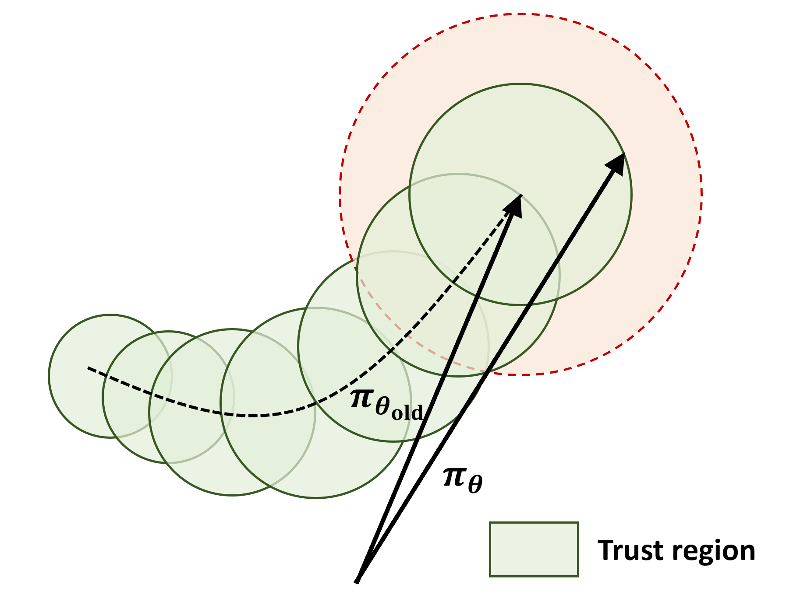
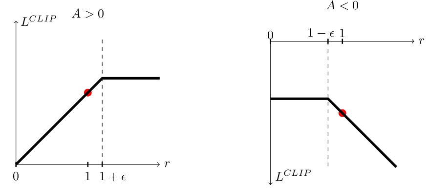
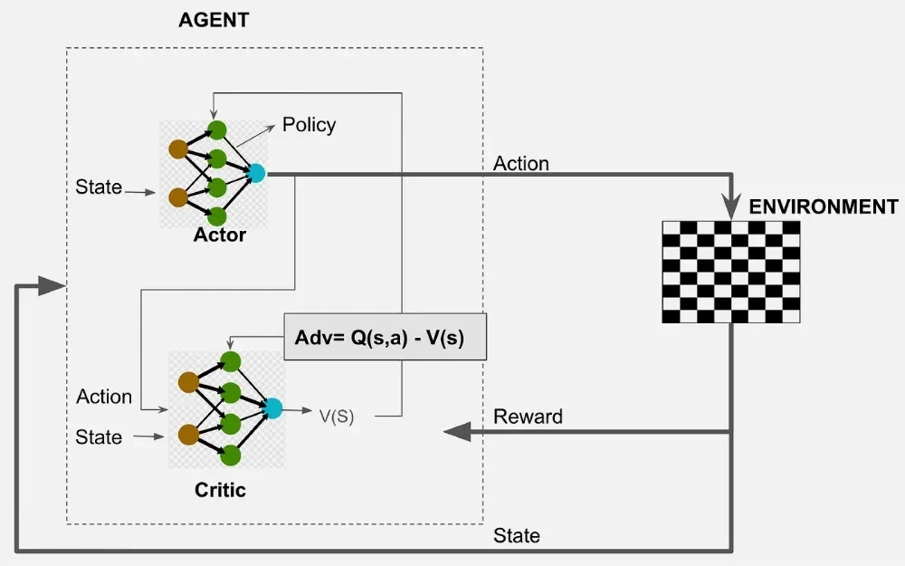

# 이론: PPO

# PPO (Proximal Policy Optimization) 정리

## 1. PPO란

- **정책을 직접 학습하는(정책 경사) 계열의 대표 알고리즘.** 2017년 OpenAI 제안.
- DQN 같은 가치 기반 방법은 행동 가짓수가 고정돼야 하는 한계가 있었다 → PPO는 Q 값을 거치지 않고 정책 자체를 학습해 **연속 행동**도 다룬다.
- 성능·안정성·구현 단순함의 균형이 좋아 오랫동안 RL의 기본값처럼 쓰였고, LLM **RLHF**(정렬) 단계에도 쓰인다.

---

## 2. 정책 경사: 정책을 직접 배우기

- DQN은 Q 값을 배우고 최댓값 행동을 고르는 **간접적** 방식. 정책 경사(policy gradient)는 신경망이 곧 정책 `π(a|s)`가 되어 **각 행동을 할 확률을 직접 출력**한다.
- 학습 원리: **보상이 컸던 행동의 확률은 높이고, 나빴던 행동의 확률은 낮춘다.**
- 장점: 연속 행동 처리 가능(로봇 제어), 확률적 선택이라 탐험이 자연스러움, 확률적 정책이 필요한 문제에도 대응.
  


### 어드밴티지

- **`A(s,a) = Q(s,a) − V(s)`**: "이 행동이 그 상태의 평균적 기대치보다 얼마나 나았는가".
- 보상 절댓값이 아니라 **평균 대비 우위**로 판단해야 정확하다 — 원래 좋은 상황이면 아무 행동이나 큰 보상을 받을 수 있으므로.
- 어드밴티지가 양수면 해당 행동의 확률을 높이고, 음수면 낮춘다.

---

## 3. 문제: 한 걸음이 너무 크면 무너진다

- 정책 경사는 **on-policy** — 지금 정책이 겪은 경험으로 그 정책을 직접 개선한다.
- 한 번의 업데이트로 정책이 **너무 크게 바뀌면** 방금 모은 경험(옛 정책이 만든 데이터)이 더 이상 현재 정책을 대변하지 못한다.
- 더 심각한 것은 **정책이 곧 데이터를 만든다는 점**: 정책이 망가지면 나쁜 데이터만 수집되고, 그 데이터로 학습하니 더 나빠지는 **악순환**이 생긴다. 지도학습처럼 "데이터는 그대로니 다시 배우면 됨"이 통하지 않는다.
- 반대로 걸음을 너무 작게 하면 학습이 한없이 느려진다. 핵심 질문: **충분히 빠르면서도 무너지지 않을 만큼만 정책을 바꾸려면?**

---

## 4. TRPO — 신뢰 영역

- **TRPO(Trust Region Policy Optimization)**: 새 정책이 기존 정책에서 크게 벗어나지 않는 **신뢰 영역** 안에서만 개선하도록 수학적으로 엄밀히 제약.
- 안정적이지만 계산이 복잡하고 구현이 까다롭다는 대가가 있었다.
- **PPO(Proximal)**: 같은 목표를 훨씬 단순한 방법으로 달성 — 새 정책을 기존 정책 "가까이(proximal)"에 붙들어 둔다.

---

## 5. PPO의 핵심: 클리핑

- 정책 변화폭을 **비율(ratio)** 로 측정: 같은 상태·행동에 대해 새 정책 확률이 기존 정책 확률 대비 몇 배인가. `ratio = 1`이면 불변, `2`면 두 배, `0.5`면 절반.
- 이 비율이 일정 범위(흔히 `[0.8, 1.2]`, 즉 `1 ± ε`)를 벗어나면 **더 이상 이득으로 쳐주지 않도록 목적함수를 클리핑**한다.

```
어드밴티지 > 0 (좋았던 행동): ratio가 1.2를 넘으면 그 이상은 이득으로 계산 안 함
어드밴티지 < 0 (나빴던 행동): ratio가 0.8 밑으로 내려가도 그 이상은 이득으로 계산 안 함
```


- 정책을 크게 바꿔봐야 **보상(그래디언트 이득)으로 돌아오는 게 없으니**, 모델 스스로 큰 변화를 시도할 유인을 잃는다. 강제로 막는 게 아니라 "과하게 움직일 이유를 없애는" 방식.
- TRPO의 복잡한 제약을 몇 줄의 클리핑 코드로 대체 → 구현이 훨씬 쉬우면서도 잘 작동. **PPO가 널리 퍼진 가장 큰 이유.**

---

## 6. PPO의 전체 구조

- **액터-크리틱** 구조로 동작한다.
    - **액터(actor)**: 정책 신경망. 상태 → 행동 확률 출력. 클리핑된 목적함수로 갱신.
    - **크리틱(critic)**: 가치 신경망. `V(s)`를 추정해 어드밴티지 계산의 기준(평균) 제공.
- 학습 루프:

```
현재 정책으로 환경과 상호작용해 경험 수집
→ 크리틱으로 각 행동의 어드밴티지 계산
→ 클리핑된 목적함수로 액터를 여러 번 업데이트
→ 새 정책으로 다시 경험 수집 (반복)
```


- on-policy는 보통 경험을 한 번 쓰고 버리지만, PPO는 클리핑이 안전장치가 되어 **한 번 모은 경험으로 여러 번 업데이트**해도 잘 무너지지 않는다 → on-policy 안정성 + 향상된 데이터 효율.

---

## 7. 왜 널리 쓰이는가 / RLHF와의 연결

- 어느 한 지표가 압도적이라기보다 **균형**이 강점: TRPO급 안정성 + 훨씬 단순한 구현, 이산·연속 행동 모두 지원, 하이퍼파라미터에 상대적으로 둔감.
- **RLHF**에서 언어 모델을 사람 선호에 맞춰 다듬는 데 쓰인다.
    - 대응 관계: 언어 모델 = 정책, 다음 토큰 선택 = 행동, 사람 선호를 학습한 보상 모델 = 보상.
    - PPO의 클리핑("원래 정책에서 너무 멀어지지 않게")이 여기서 특히 중요 — 모델이 보상 점수만 좇다가 원래 언어 능력을 잃고 이상한 문장을 뱉는 것을 막아준다.
