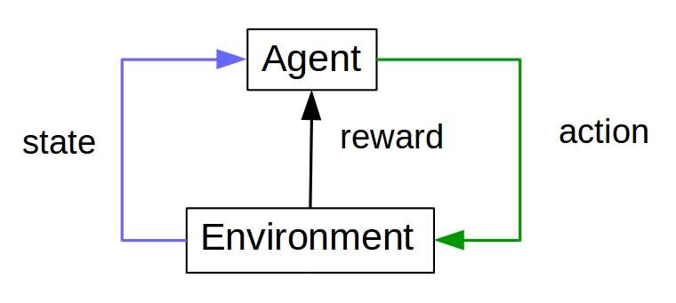
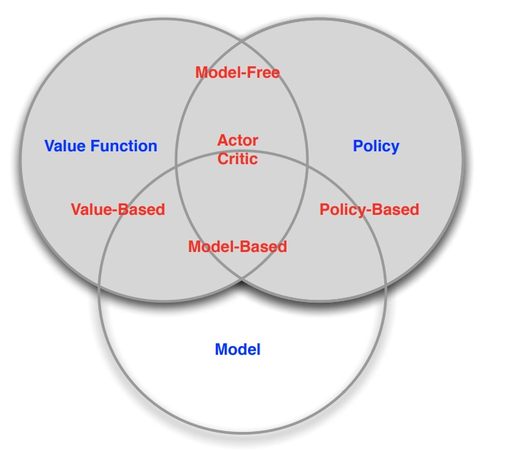

# 이론: 강화학습 기초

# 강화학습(Reinforcement Learning) 정리

## 1. 강화학습이란

- **시행착오로 의사결정을 배우는 학습.** 정답 데이터를 주는 지도학습과 다르다.
- 에이전트가 환경에서 행동하고, 그 결과로 **보상**이라는 스칼라 신호만 받는다. 어떤 행동이 정답인지는 알려주지 않는다. 오직 **보상의 총합(누적 보상)** 을 최대화하도록 스스로 정책을 찾아야 한다.
- 한 줄 정의: **순차적 의사결정 문제**를 푸는 방법론. "지금 이 행동이 미래 전체에 얼마나 이득인가"를 배운다.

### 지도학습과의 차이

| 구분 | 지도학습 | 강화학습 |
| --- | --- | --- |
| 신호 | 정답 라벨 `y` | 보상 `r` (좋다/나쁘다 정도만) |
| 데이터 | i.i.d. 고정 분포 | 정책이 데이터를 스스로 만듦 (분포가 계속 바뀜) |
| 피드백 시점 | 즉시 | 지연됨 (수십~수천 스텝 뒤) |
| 목표 | 예측 오차 최소화 | 기대 누적 보상 최대화 |
- ① **정답 라벨 없음** — "고양이"라고 알려주는 대신 "0.3점"만 준다. 더 나은 행동이 뭐였는지는 안 알려준다(평가적 피드백 vs 지시적 피드백).
- ② **행동이 다음 상태를 바꿈** — 데이터가 독립이 아니다. 정책이 나쁘면 나쁜 데이터만 모이고, 그 데이터로 배우면 더 나빠지는 악순환이 가능하다.
- ③ **보상이 지연됨** — 바둑에서 승패는 마지막에 한 번. 200수 중 어느 수가 승리의 공로인지 불분명하다.

### 활용 분야

- 게임 AI·NPC (Atari, StarCraft II, Dota 2)
- 로봇 제어와 보행 (사족보행, 손 조작)
- 자율주행 의사결정 (차선 변경, 합류)
- 자원 스케줄링 (데이터센터 냉각, 칩 배치, 네트워크 라우팅)
- LLM 정렬 (RLHF/RLAIF)

---

## 2. 기본 루프와 MDP

### 루프

```
상태 s_t 관찰 → 정책 π로 행동 a_t 선택 → 환경이 보상 r_{t+1}과 다음 상태 s_{t+1} 반환 → 반복
```


- 시점 `t`마다 한 번씩 돌고, 종료 조건(목표 도달·실패·시간 초과)을 만나면 **에피소드**가 끝난다.
- 한 에피소드의 기록 `τ = (s_0, a_0, r_1, s_1, a_1, r_2, …)` 를 **궤적(trajectory)** 이라 한다.
- 학습은 "루프를 돌려 궤적을 모은다 → 그 궤적으로 정책/가치를 갱신한다"의 반복이다. 갱신하면 정책이 바뀌고, 정책이 바뀌면 다음에 모이는 데이터도 바뀐다. 이 **피드백 루프**가 RL의 본질이자 불안정성의 근원이다.

### 형식화: MDP

- RL 문제는 보통 **마르코프 결정 과정(MDP)** `⟨S, A, P, R, γ⟩` 로 정의한다.
    - `S`: 상태 공간, `A`: 행동 공간
    - `P(s'|s,a)`: 전이 확률 — 환경의 동역학
    - `R(s,a)`: 보상 함수
    - `γ`: 할인율
- **마르코프 성질**: 다음 상태는 오직 현재 상태와 행동에만 의존한다. 과거 전체를 기억할 필요가 없다.
    - 현실에선 잘 안 지켜진다. 예) 화면 한 장으로는 공의 속도를 모른다 → DQN은 프레임 4장을 쌓아 상태를 만든다.
    - 상태 일부만 보이면 **POMDP**. 해법은 프레임 스택, RNN/LSTM, 트랜스포머 메모리.
- **관측 ≠ 상태**: 상태는 의사결정에 필요한 정보 전부, 관측은 센서가 준 것. 둘의 간극이 클수록 문제가 어렵다.

### 에피소드형 vs 연속형

- **에피소드형**: 끝이 있다 (바둑 한 판, 로봇이 넘어질 때까지).
- **연속형**: 끝이 없다 (데이터센터 냉각, 주식 트레이딩). 총합이 발산하므로 **할인**이 필수다.

---

## 3. 할인율과 가치함수

### 리턴(Return)

- 최대화 대상은 즉시 보상이 아니라 **미래 보상의 할인 합**:

```
G_t = r_{t+1} + γ·r_{t+2} + γ²·r_{t+3} + … = Σ_{k=0}^{∞} γ^k · r_{t+k+1}
```

### 할인율 γ ∈ [0, 1]

- **왜 필요한가**
    - ① 수학적 수렴 — 무한 합을 유한하게 만든다. 보상이 `|r| ≤ R_max`면 `G ≤ R_max/(1-γ)`.
    - ② 불확실성 반영 — 먼 미래의 예측일수록 부정확하다. 할인은 "덜 믿는다"는 뜻.
    - ③ 선호 표현 — 같은 보상이면 빨리 받는 게 낫다(이자율과 같은 직관).
- **의미**: `γ`는 사실상 **유효 시야(horizon)** 를 정한다. 대략 `1/(1-γ)` 스텝 앞까지 본다.
    - `γ = 0.9` → 약 10스텝, `γ = 0.99` → 약 100스텝, `γ = 0.999` → 약 1000스텝
- **튜닝 감각**
    - `γ → 0`: 근시안. 즉시 보상만 챙긴다. 빠르게 학습되지만 장기 전략을 못 짠다.
    - `γ → 1`: 원시안. 장기 전략을 배우지만 분산이 커지고 학습이 느려진다. 신용 할당도 어려워진다.
    - 실무: 짧은 과제 `0.9~0.95`, 긴 과제 `0.99` 근처가 기본값. ML-Agents 기본값도 `0.99`.
    - **γ는 알고리즘 하이퍼파라미터인 동시에 문제 정의의 일부다.** 바꾸면 최적 정책 자체가 바뀐다.

### 가치함수

- **상태 가치 `V^π(s)`** — 상태 `s`에서 정책 `π`를 따를 때 기대 리턴.
→ "이 자리는 얼마나 유망한가"
    
    ```
    V^π(s) = E_π[ G_t | s_t = s ]
    ```
    
- **행동 가치 `Q^π(s,a)`** — `s`에서 `a`를 하고, 그 뒤로 `π`를 따를 때 기대 리턴.
→ "이 자리에서 이 수를 두면 얼마나 유망한가"
    
    ```
    Q^π(s,a) = E_π[ G_t | s_t = s, a_t = a ]
    ```
    
- **어드밴티지 `A^π(s,a) = Q^π(s,a) − V^π(s)`**
→ "평균보다 얼마나 나은 행동인가". 상태 자체의 좋고 나쁨(기저선)을 빼서 **분산을 줄인다**. 액터-크리틱의 핵심 재료(GAE).

### 벨만 방정식

- 가치는 **재귀적으로** 정의된다. 이게 RL 전체를 떠받친다.

```
벨만 기대 방정식:  V^π(s) = E[ r + γ·V^π(s') ]
벨만 최적 방정식:  Q*(s,a) = E[ r + γ·max_{a'} Q*(s',a') ]
```

- 의미: **"지금 가치 = 즉시 보상 + 할인된 다음 상태의 가치"**. 끝까지 안 가봐도 다음 한 스텝 추정치로 현재를 고칠 수 있다.
- 이 아이디어의 구현이 **TD 학습**:
    
    ```
    TD 타깃: r + γ·V(s')TD 오차 δ = r + γ·V(s') − V(s)갱신:    V(s) ← V(s) + α·δ
    ```
    
- **부트스트래핑** — 추정치로 추정치를 갱신하는 것. 빠르고 분산이 낮지만, 편향이 있고 발산 위험이 생긴다.
- 스펙트럼: **MC(끝까지 감, 편향 0·분산 큼) ↔ TD(1스텝, 편향 큼·분산 작음)**. 중간이 n-step, 그 가중 평균이 TD(λ)·GAE.

### 정책과 목적함수

- **정책 `π`**: 상태 → 행동의 사상. 결정적 `a = π(s)` 또는 확률적 `π(a|s)`.
- 최종 목표: `max_π J(π) = E_{τ~π}[ G_0 ]`
- 두 갈래 해법 — **가치를 배워 정책을 유도**(argmax Q)하거나, **정책을 직접 최적화**(정책 경사)한다. 이게 뒤에 나오는 축 2다.

---

## 4. 탐험과 활용 (Exploration vs Exploitation)

### 딜레마

- **활용(exploitation)**: 지금까지 알아낸 최선의 행동을 반복 → 당장의 보상 확보
- **탐험(exploration)**: 안 해본 행동 시도 → 더 나은 선택지 발견 가능, 단 당장은 손해
- 비유: 늘 가던 맛집만 갈 것인가(활용), 새 가게를 뚫을 것인가(탐험).
- 근본 원인: 에이전트는 **자기가 선택한 행동의 결과만** 본다. 안 해본 행동의 값은 영원히 모른다. → 탐험을 안 하면 **국소 최적**에 갇힌다.
- 지도학습에는 이 문제가 없다. 데이터가 이미 주어져 있기 때문.

### 주요 전략

| 전략 | 방식 | 특징 |
| --- | --- | --- |
| **ε-greedy** | 확률 ε로 무작위, 1−ε로 argmax | 가장 단순. DQN 표준. 보통 ε를 1.0 → 0.05로 감쇠 |
| **볼츠만/소프트맥스** | Q값에 비례한 확률로 선택 | "나쁜 행동은 덜, 애매한 행동은 자주". 온도 τ로 조절 |
| **UCB** | `Q(a) + c·√(ln t / N(a))` | 덜 해본 행동에 보너스. **불확실할수록 낙관적으로** |
| **엔트로피 보너스** | 목적함수에 `+ β·H(π)` 추가 | 정책이 한 행동으로 조기 수렴하는 걸 막음. PPO·SAC |
| **행동 노이즈** | 연속 행동에 가우시안/OU 노이즈 | DDPG·TD3. 연속 제어에서 ε-greedy 대체 |
| **파라미터 노이즈** | 가중치 자체에 노이즈 | 일관성 있는 탐험(한 에피소드 내내 같은 성향) |
| **내재적 동기** | 예측 오차·호기심을 보상으로 (ICM, RND) | 외부 보상이 거의 없는 희소 보상 환경용 (Montezuma's Revenge) |

### 감각 잡기

- **탐험량은 시간에 따라 줄이는 게 정석.** 초반엔 많이, 후반엔 적게. (ε 감쇠, 온도 감쇠)
- **SAC는 아예 엔트로피를 목적함수에 넣었다** — "보상도 최대화하고 정책도 최대한 무작위하게". 탐험을 하이퍼파라미터가 아니라 **학습 목표**로 승격시킨 것. 게다가 엔트로피 계수 α도 자동 조절한다.
- **희소 보상 문제**: 보상이 1000스텝에 한 번 나오면 무작위 탐험으로는 절대 못 찾는다. → 내재적 보상, 커리큘럼, 보상 셰이핑, 시연 데이터(imitation)로 해결.
- **보상 셰이핑 주의**: 중간 보상을 잘못 주면 에이전트가 **보상 해킹**을 한다. (예: 보트 레이스에서 완주 대신 아이템만 무한 수집)

---

## 5. 핵심 난제 (RL이 어려운 이유)

- **탐험 vs 활용** — 위 참조. 정보 수집과 이익 실현의 트레이드오프.
- **신용 할당(credit assignment)** — 지연된 보상이 어느 행동의 공로인지 가리기. 200수 중 승부를 가른 건 47수였을 수 있다. → TD·어드밴티지·GAE가 이 문제를 완화한다.
- **샘플 효율** — 보통 막대한 시행 횟수가 필요. DQN은 아타리 한 게임에 수천만 프레임(사람 기준 수십 년치)을 쓴다. 실물 로봇에선 치명적 → 시뮬레이터 + sim-to-real.
- **비정상성(non-stationarity)** — 정책이 바뀌면 데이터 분포도, 학습 타깃도 같이 움직인다. **움직이는 과녁을 쏘는 격.** → 타깃 네트워크로 완화.
- **안정성 / deadly triad** — 다음 셋이 겹치면 발산 위험:
    1. 함수 근사(신경망)
    2. 부트스트래핑(추정치로 추정치 갱신)
    3. off-policy(다른 정책의 데이터로 학습)
    - DQN은 이 셋을 다 쓰면서도 **경험 재생 + 타깃 네트워크**로 억지로 안정화시켜 성공했다.
- **보상 설계** — 원하는 걸 정확히 보상으로 옮기기 어렵다. 잘못 쓰면 보상 해킹.
- **재현성** — 시드에 따라 결과가 크게 흔들린다. 논문 결과를 그대로 재현하기 어렵기로 악명 높다.

---

## 6. RL 구성 요소

| 요소 | 정의 | 예 (자율주행) |
| --- | --- | --- |
| **에이전트** | 환경 속에서 결정을 내리고 행동하는 주체 | 주행 소프트웨어 |
| **환경** | 에이전트가 상호작용하는 외부 세계 | 도로, 다른 차, 신호 |
| **상태** | 에이전트가 인지하는 현재 환경의 상황 | 카메라·라이다 관측, 속도 |
| **행동** | 현재 상태에서 선택할 수 있는 행동 | 조향각, 가감속 |
| **보상** | 특정 행동 수행 시 환경에서 얻는 피드백 | 전진 +, 충돌 −, 급정거 − |
| **정책** | 어떤 행동을 할지 결정하는 전략 | 관측 → 조향/가속 |
| **가치함수** | 상태·행동의 장기 유망도 | "이 차선이 얼마나 유리한가" |
| **모델** *(선택)* | 환경 동역학 `P(s' / s,a)` 의 예측 |
- **행동 공간**의 형태가 알고리즘 선택을 좌우한다.
    - **이산**: {상, 하, 좌, 우} → 가치 기반(DQN)이 자연스럽다. argmax가 쉽다.
    - **연속**: 관절 토크 ∈ ℝ⁶ → argmax가 불가능. 정책 기반/액터-크리틱(SAC, TD3)이 필요하다.

---

## 7. 알고리즘 분류 3축

세 축은 독립적이며, 실제 알고리즘은 **세 축의 조합**으로 결정된다.



### 축 1 — 모델-프리 vs 모델-기반 (환경 모델로 계획하는가)

여기서 "모델"은 신경망이 아니라 **환경의 동역학** `P(s'|s,a)` 와 `R(s,a)` 를 뜻한다.

- **모델-프리** — 환경 원리를 모른 채 경험만으로 학습.
    - 예) 자전거를 수천 번 넘어지며 몸으로 익힘. 물리 방정식은 몰라도 탄다.
    - 장점: 구현이 단순, 모델 오차 걱정 없음, 환경이 복잡해도 잘 통함
    - 단점: 샘플 효율이 나쁨. 실제 시행이 필요
    - 대표: DQN, PPO, SAC
- **모델-기반** — 모델로 미래를 시뮬레이션해 계획.
    - 예) 체스에서 두기 전 머릿속 수읽기. "이러면 저러겠지"를 돌려본다.
    - 두 갈래: **모델이 주어짐**(AlphaZero — 바둑 규칙은 이미 안다) vs **모델도 학습**(MuZero, Dreamer)
    - 쓰는 법: ① 상상 속에서 롤아웃해 정책 학습(Dreamer), ② 실행 시점에 트리 탐색으로 계획(AlphaZero/MCTS)
    - 장점: 샘플 효율이 압도적(상상으로 연습 가능), 계획으로 성능 끌어올림
    - 단점: 모델 오차가 **누적**된다. 부정확한 모델로 100스텝 상상하면 완전한 환상. 구현도 복잡.
    - 대표: AlphaZero(규칙 주어짐), MuZero(규칙도 학습), Dreamer, World Models
- **정리**: 샘플 효율은 모델-기반이 높고, 단순함·범용성·안정성은 모델-프리가 우위. 실물 상호작용이 비싸면(로봇) 모델-기반, 시뮬레이터가 값싸면(게임) 모델-프리.

### 축 2 — 가치 vs 정책 vs 액터-크리틱 (무엇을 학습하는가)

- **가치 기반** — `Q(s,a)`를 배우고 최댓값 행동을 선택(`argmax_a Q`). 정책은 Q에서 **유도**된다.
    - 잘 맞는 곳: **이산·저차원 행동**. 샘플 효율이 상대적으로 좋다(off-policy와 궁합).
    - 한계: 연속 행동에서 `argmax`가 불가능. 결정적 정책이라 확률적 최적 정책(가위바위보 같은 것)을 표현 못 함.
    - 대표: DQN, Double DQN, Dueling DQN, Rainbow, SARSA
- **정책 기반** — 정책 `π_θ(a|s)`를 직접 경사 상승으로 최적화.
    - 정책 경사 정리: `∇J ≈ E[ ∇log π(a|s) · G_t ]` → "좋은 결과를 낸 행동의 확률을 올려라"
    - 잘 맞는 곳: **연속 행동**(로봇 관절 토크), **확률적 정책**이 필요한 곳
    - 한계: 리턴 `G_t`를 그대로 쓰면 **분산이 매우 크다**. 그래서 느리고 불안정.
    - 대표: REINFORCE
- **액터-크리틱** — 액터(정책) + 크리틱(가치)의 협업.
    - 크리틱이 `V(s)`를 배워 **기저선**으로 빼준다 → `G_t` 대신 어드밴티지 `A_t`를 쓴다 → **분산이 크게 줄고 안정화**된다.
    - 사실상 현대 RL의 주류. 정책의 표현력 + 가치의 저분산을 둘 다 취한다.
    - 대표: PPO, SAC, DDPG, TD3, A3C, A2C → **ML-Agents PPO가 여기**
- **비유**
    - 가치 기반: 리뷰 평점 보고 1등 식당 선택
    - 정책 기반: 직감대로 행동하고 결과로 직감을 보정
    - 액터-크리틱: 코치(크리틱)가 옆에서 실시간 피드백 주는 배우(액터)

### 축 3 — on-policy vs off-policy (어떤 데이터로 배우는가)

- 핵심 질문: **학습 대상 정책(target policy)** 과 **데이터를 만든 정책(behavior policy)** 이 같은가?
- **on-policy** — 같다. 현재 정책이 만든 데이터만 사용하고, 한 번 갱신하면 폐기.
    - 장점: 학습이 안정적, 이론이 깔끔
    - 단점: 비효율. 매번 새 데이터를 모아야 하고 재사용 불가 → 시뮬레이터가 값싸야 성립
    - PPO는 **클리핑**으로 "정책이 조금 변한 동안은 데이터를 몇 번 더 쓰자"는 절충을 한다(약한 off-policy 성격).
    - 대표: REINFORCE, A3C, TRPO, PPO, SARSA
- **off-policy** — 다르다. **경험 재생 버퍼**에 쌓아두고 과거 데이터·남의 시연 데이터까지 재사용.
    - 장점: 샘플 효율이 높다. 데이터 재사용, 시연 학습, 병렬 수집 모두 가능
    - 단점: 데이터 분포와 현재 정책의 괴리 → 불안정. deadly triad의 한 축.
    - 대표: Q-learning, DQN, DDPG, TD3, SAC
- **절벽 걷기(Cliff Walking) 예** — 차이를 보여주는 고전 예제
    - **Q-learning(off-policy)**: 타깃이 `max_a' Q(s',a')` → 탐험 실수를 무시하고 **최적 정책**을 배운다. 절벽 바로 옆 최단 경로를 학습. 하지만 ε-greedy로 실제 걸으면 가끔 떨어져 성능은 나쁘다.
    - **SARSA(on-policy)**: 타깃이 `Q(s', a')` (실제 고른 행동) → **자기 탐험 실수까지 반영**한다. "가끔 미끄러진다"를 알고 절벽에서 떨어진 안전 우회로를 학습. 실제 성능은 더 좋다.
    - 교훈: **최적 정책을 배우는 것 ≠ 실제로 잘 하는 것.** 탐험 중 위험이 있는 환경에선 on-policy가 안전하다.

### 대표 모델 좌표

| 모델 | 모델 유무 | 학습 대상 | 데이터 | 특징 |
| --- | --- | --- | --- | --- |
| DQN | 모델-프리 | 가치 | off-policy | 이산 행동, 경험 재생 + 타깃 네트워크 |
| REINFORCE | 모델-프리 | 정책 | on-policy | 정책 경사의 원형, 고분산 |
| PPO | 모델-프리 | 액터-크리틱 | on-policy | 클리핑으로 안정화, ML-Agents 기본 |
| SAC | 모델-프리 | 액터-크리틱 | off-policy | 연속 제어, 엔트로피 최대화, 효율적 |
| DDPG·TD3 | 모델-프리 | 액터-크리틱 | off-policy | 연속 제어(로봇), 결정적 정책 |
| AlphaZero | 모델-기반 | 가치+정책 | 계획(탐색) | 규칙 주어짐 + MCTS |
| MuZero | 모델-기반 | 가치+정책 | off-policy | 모델(동역학)까지 학습 |
| Dreamer | 모델-기반 | 액터-크리틱 | off-policy | 잠재 공간 상상으로 학습 |

### ML-Agents가 PPO를 기본 채택한 이유

- 구현이 단순하고 하이퍼파라미터 튜닝에 둔감하다
- 이산·연속 행동을 모두 지원한다
- on-policy라 안정적이고, 유니티는 시뮬레이터를 **병렬로 무한 생성**할 수 있어 샘플 효율의 단점이 상쇄된다
- 발산이 거의 없다 → 비전문가도 쓸 수 있다

---

## 8. 발전 과정

### 토대 (1950s~80s)

- **동적 계획법 / 벨만 방정식** (Bellman, 1957) — 가치의 재귀 구조 확립. 단, 환경 모델을 알아야 하고 상태를 전부 훑어야 한다.
- **시간차 학습 TD** (Sutton & Barto, 1988) — 끝까지 안 가도 다음 추정치로 현재를 갱신. 모델 없이, 온라인으로. → **현대 RL의 심장**
- 배경: 동물 행동심리학의 시행착오 학습 + 최적 제어 이론의 결합

### 고전 (1989~90s)

- **Q-learning** (Watkins, 1989) — off-policy 가치 학습. 어떤 정책으로 데이터를 모아도 최적 Q로 수렴한다는 증명.
- **SARSA** (1994) — on-policy 대응물
- **REINFORCE** (Williams, 1992) — 정책 경사의 시작
- **TD-Gammon** (Tesauro, 1992) — 신경망 + TD로 백개먼 세계 정상급. **딥 RL의 최초 증거**였으나 다른 도메인으로 일반화되지 못해 겨울이 왔다.

### 심층 RL 혁명 (2013~17)

- **DQN** (2013/2015) — Q-learning + CNN. 픽셀만 보고 아타리 49게임 정복. 안정화의 두 열쇠:
    - **경험 재생** — 데이터 상관을 깨고 재사용
    - **타깃 네트워크** — 타깃을 얼려 움직이는 과녁 문제 완화
- **AlphaGo** (2016) → **AlphaZero** (2017) — 탐색(MCTS) + 학습(신경망). 자기대국만으로 인간 지식 없이 초월.
- **TRPO** (2015) → **PPO** (2017) — "정책을 한 번에 과하게 바꾸지 말자". PPO는 클리핑으로 TRPO를 단순화 → 사실상의 표준.
- **DDPG** (2015) — 연속 행동을 위한 결정적 액터-크리틱
- **A3C** (2016) — 병렬 액터로 경험 재생 없이 상관 깨기

### 대규모 응용 (2018~)

- **TD3** (2018) — DDPG의 Q 과대추정을 쌍둥이 크리틱으로 교정
- **SAC** (2018) — 엔트로피 최대화 + off-policy. 연속 제어의 실무 표준
- **MuZero** (2019) — 규칙조차 모른 채 동역학 모델을 스스로 학습해 계획
- **AlphaStar / OpenAI Five** (2019) — 불완전 정보·초대규모 행동 공간의 실시간 전략 게임
- **RLHF** (2019~, InstructGPT 2022) — 사람 선호를 보상 모델로 학습하고 PPO로 LLM 정렬. **RL이 AI 정렬의 핵심 도구로 부상.**
- **이후 흐름** — DPO 등 RL 없는 정렬 대안, RLAIF(AI 피드백), 그리고 추론 능력을 위한 **검증 가능한 보상 기반 RL(RLVR)** 로 확장 중
