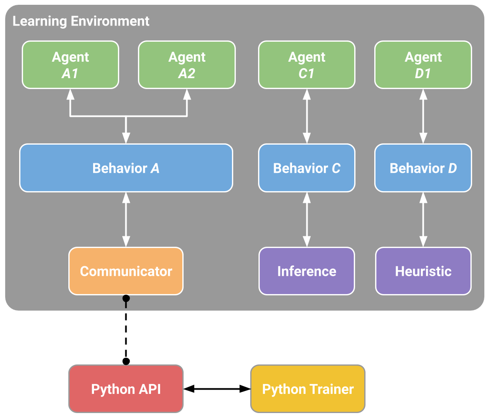

# 이론: ML-Agents 개요

## Unity ML-Agents 개요

> 이 문서에서는 "알고리즘"(PPO)은 `week1/이론-PPO.md` 에서 끝냈다고 보고, 여기서는 **그 알고리즘을 Unity 게임 환경에 연결하는 틀**을 다룬다. 설치는 `week1/실습-mlagents_셋업.md`, 실제 설계 요령은 `week2/이론-에이전트_설계.md`.
>
>
> 공식 문서: <https://docs.unity3d.com/Packages/com.unity.ml-agents@4.0/manual/ML-Agents-Overview.html>

---

## 1. ML-Agents란

- Unity 씬을 **강화학습 환경**으로 바꿔 주는 오픈소스 툴킷. 게임/시뮬레이션 속 캐릭터를 신경망으로 학습시킨다.
- **PPO에서 배운 것**: "정책을 어떻게 업데이트하는가"라는 *알고리즘*. **ML-Agents가 채워 주는 것**: 그 알고리즘에 먹일 **경험(관측·행동·보상)을 Unity에서 뽑아내고, 학습된 정책을 다시 게임에 꽂는 배관(plumbing)**.
- 즉 우리는 트레이너를 새로 짤 필요가 없다. **환경을 설계(무엇을 보고, 무엇을 하고, 무엇으로 보상받는가)** 하면, 내장된 PPO/SAC 트레이너가 학습을 담당한다.
- 기본 학습 알고리즘이 **PPO**인 것은 우연이 아니다 — 이산·연속 행동을 모두 다루고, 하이퍼파라미터에 둔감하며 안정적이라 "게임 AI 범용 기본값"으로 적합하기 때문(PPO 문서 7장 참고).

---

## 2. 큰 그림 — 두 프로세스, 다섯 컴포넌트

셋업 문서에서 봤듯 학습은 **Unity(환경)와 Python(두뇌)이 소켓으로 대화**하며 돈다. ML-Agents는 이 구조를 다섯 조각으로 나눈다.




| 컴포넌트 | 사는 곳 | 역할 |
| --- | --- | --- |
| **Learning Environment** | Unity | 씬·캐릭터. `com.unity.ml-agents` C# 패키지로 활성화. Agent·Behavior를 품는다. |
| **External Communicator** | Unity 내부 | 환경과 파이썬을 잇는 통신 채널(gRPC). |
| **Python Low-Level API** | Python (`mlagents_envs`) | 파이썬에서 환경을 조작하는 저수준 인터페이스. 트레이너가 이 위에서 돈다. |
| **Python Trainers** | Python (`mlagents`) | 실제 ML 알고리즘(PPO/SAC…). `mlagents-learn` CLI로 실행. |
| **Gym / PettingZoo 래퍼** | Python | 표준 RL 프레임워크와 붙일 때 쓰는 선택적 연동층. |

> **핵심**: 학습 중에는 두 프로세스가 동시에 떠 있어야 한다. Unity가 경험을 만들어 보내면, 파이썬이 정책을 갱신해 "다음엔 이렇게 행동하라"를 돌려준다. 학습이 끝나면 정책은 `.onnx` 파일로 굳고, 그 뒤엔 Unity 혼자(추론 모드)서 돌릴 수 있다.

---

## 3. RL 루프는 Unity에서 어떻게 도는가

강화학습의 표준 사이클(상태 → 행동 → 보상 → 다음 상태)이 ML-Agents에서는 이렇게 매핑된다.

```
매 "결정 스텝"마다:
  1) Agent 가 관측(Observation)을 수집   ← CollectObservations() / Sensor
  2) Behavior(정책)가 관측을 받아 행동을 결정
  3) Agent 가 행동을 실행               ← OnActionReceived()
  4) 환경(게임 물리)이 한 스텝 진행되고, Agent 가 보상을 부여  ← AddReward/SetReward
  5) 종료 조건이면 에피소드를 끝내고 리셋  ← EndEpisode() → OnEpisodeBegin()
```

- **MDP 대응**: 관측 = 상태 `s`, 행동 = `a`, 보상 = `r`, 에피소드 = 하나의 시행(trial). PPO가 이 `(s, a, r)` 궤적을 모아 어드밴티지를 계산하고 정책을 갱신한다.
- **결정 주기**는 매 프레임이 아니다 — 보통 몇 물리 프레임마다 한 번 결정한다(→ Decision Requester, 4·5장).

---

## 4. 핵심 용어

| 용어 | 뜻 |
| --- | --- |
| **Agent** | 씬의 GameObject에 붙는 스크립트. 관측 수집·행동 수행·보상 부여를 담당. `Agent` 클래스를 상속해 작성한다. |
| **Behavior** | 에이전트의 "정책 정의". 관측→행동 매핑, 행동 개수 등 속성을 규정. 여러 에이전트가 **같은 Behavior를 공유**하면 하나의 정책을 함께 학습한다(데이터 병렬 수집). |
| **Behavior Name** | Behavior의 고유 이름. **Unity 인스펙터의 이 문자열이 파이썬 config의 키와 일치해야** 학습이 연결된다(11장). |
| **Policy(정책)** | 관측 → 행동의 (최적) 매핑. 학습으로 얻어지는 신경망 그 자체. |
| **Observation(관측)** | 에이전트가 환경에서 *인지하는* 정보. 씬 전체 상태(state)가 아니라 **에이전트가 아는 것만**. 수치(vector)·시각(visual) 가능. |
| **Action(행동)** | 에이전트가 취하는 조작. 연속(continuous)·이산(discrete). |
| **Reward(보상)** | 얼마나 잘하고 있는지 나타내는 스칼라. 설계자가 코드로 부여한다. |
| **Episode(에피소드)** | 시작~종료까지 하나의 시행. 종료(성공/실패/타임아웃) 시 리셋. |
| **Academy** | 환경 전역을 관장하는 싱글턴. 모든 에이전트의 스텝을 동기화하고 파이썬과의 통신을 조율. 대개 직접 건드릴 일은 없다. |
| **Decision Requester** | 몇 스텝마다 정책에 "결정을 요청"할지 정하는 컴포넌트. |

> **주의 — 관측 ≠ 상태**: 환경 상태는 씬 전체 정보지만, 에이전트 관측은 그 에이전트가 아는 부분집합이다. 무엇을 관측에 넣고 뺄지가 학습 성패를 가른다(→ 설계 문서 2장).

---

## 5. 실제로 인스펙터에서 붙이는 것 — 컴포넌트 3+1 세트

에이전트 하나를 만들 때 GameObject에 보통 이 조합이 붙는다.

| 컴포넌트 | 하는 일 |
| --- | --- |
| **Agent 스크립트** (내가 작성) | `CollectObservations()`(관측), `OnActionReceived()`(행동+보상), `OnEpisodeBegin()`(리셋), `Heuristic()`(수동 조작)을 구현. |
| **Behavior Parameters** | 이 에이전트의 Behavior 정의. **Behavior Name**, 관측 크기(Vector Observation Space Size), 행동 규격(Continuous/Discrete Actions), **Behavior Type**, 추론용 모델(.onnx) 등을 설정. |
| **Decision Requester** | `Decision Period`(몇 스텝마다 결정할지), `Take Actions Between Decisions`(결정 사이 프레임에 직전 행동을 유지할지) 설정. |
| **Sensor 컴포넌트** (선택) | 관측을 자동 생성. `Ray Perception Sensor 3D/2D`(레이캐스트), `Camera Sensor`/`Render Texture Sensor`(시각), `Grid Sensor` 등. `CollectObservations()`를 손으로 안 짜도 되게 해 준다. |

> 관측을 코드(`CollectObservations`)로 넣을 수도, Sensor 컴포넌트로 자동 수집할 수도 있다. 둘을 섞어 써도 된다.

---

## 6. 관측(Observation) — 무엇을 보게 할 것인가

에이전트가 받는 입력. 네 갈래가 있고, 종류에 따라 붙는 신경망 구조가 달라진다.

| 관측 종류 | 방법 | 신경망 | 언제 |
| --- | --- | --- | --- |
| **벡터(Vector)** | `AddObservation(float/Vector3/…)` 또는 직접 수치 나열 | 완전연결(FC) | 위치·속도·거리 등 수치를 직접 알 때. **가장 빠르고 기본**. |
| **레이캐스트(Ray Cast)** | `Ray Perception Sensor` | 완전연결(FC) | "시야에 뭐가 있나"를 광선으로 스캔. 벽·적·아이템 감지. 시각보다 훨씬 가볍다. |
| **시각(Visual)** | `Camera Sensor` / `Render Texture Sensor` | CNN (Simple / Nature-CNN / IMPALA ResNet 중 선택) | 픽셀에서 직접 학습(DQN처럼). 강력하지만 **느리고 데이터를 많이 먹는다** → 최후의 수단. |
| **가변 길이(Variable Length)** | 버퍼형 관측 | 어텐션(Attention) | 관측 대상 개수가 매번 다를 때(주변 적이 3개였다 7개였다). |
| **메모리(Memory)** | `Behavior Parameters`에서 LSTM 활성화 | 순환(RNN/LSTM) | 과거를 기억해야 결정 가능한 부분 관측 문제. |

- 순간 관측만으로 속도·방향 같은 **시간 정보**가 부족하면, **관측 스태킹(Stacked Vectors)**으로 최근 몇 프레임을 함께 넣어 해결한다(LSTM보다 가볍다).

---

## 7. 행동(Action) — 무엇을 하게 할 것인가

정책의 출력. PPO가 이산·연속을 모두 지원하므로 둘 다 쓸 수 있다.

- **연속(Continuous)**: 실수 벡터. 예) 조향각, 가속량, 관절 토크. `Continuous Actions` 개수로 지정. 로봇 제어·물리 조작에 적합.
- **이산(Discrete)**: 정수 선택. **브랜치(branch)** 여러 개로 나눌 수 있다. 예) 브랜치0 = {정지, 전진, 후진}, 브랜치1 = {회전 없음, 좌회전, 우회전}. 각 브랜치가 독립적으로 하나를 고른다.
- **행동 마스킹(Action Masking)**: 이산 행동에서 **지금 불가능한 선택지를 차단**한다(벽을 향해 전진 금지 등). 탐색 낭비를 줄여 학습을 빠르게 한다.
- 한 에이전트가 연속·이산을 **동시에** 가질 수도 있다.

---

## 8. 보상(Reward) & 보상 신호(Reward Signal)

- 보상은 **설계자가 코드로 부여**한다: `AddReward(v)`(누적), `SetReward(v)`(그 스텝 값 지정). 목표 달성엔 `+`, 실패엔 `-`.
- ML-Agents는 보상을 **모듈형 "신호"로 분리**해 여러 개를 합산할 수 있다.

| 보상 신호 | 출처 | 용도 |
| --- | --- | --- |
| **extrinsic** | 환경(내가 준 보상) | 기본. 대부분 이거면 된다. |
| **curiosity** | 내적(intrinsic) | 예측 오차를 보상으로 → **탐험 유도**. 희소 보상 문제 완화. |
| **rnd** (Random Network Distillation) | 내적 | 처음 보는 상태에 보너스 → 탐험 유도. |
| **gail** | 시연 기반 | 사람 시연을 흉내 내도록 보상(모방 학습, 10장). |

> 보상을 잘못 주면 **원하지 않는 행동에 최적화**된다(reward hacking). 보상 설계가 곧 문제 정의다 → 설계 문서 4장에서 집중적으로 다룬다.

---

## 9. Behavior Type — 같은 에이전트, 세 가지 실행 모드

`Behavior Parameters`의 **Behavior Type** 하나로 에이전트를 세 모드로 굴린다.

| 모드 | 동작 | 언제 |
| --- | --- | --- |
| **Default** | 파이썬이 붙어 있으면 **학습**, 없으면 붙어 있는 모델로 추론 | 평상시. 학습·추론 자동 전환. |
| **Heuristic Only** | `Heuristic()` 코드(키보드 등 사람 입력)로 행동 | **관측·보상·환경 검증**. 학습 전 손으로 조종해 배관이 맞는지 확인. |
| **Inference Only** | 붙어 있는 `.onnx` 모델로만 추론 | 학습 끝난 정책 배포·플레이. |

> `Heuristic Only`로 직접 플레이해 보는 것은 학습 전 **가장 값싼 디버깅**이다 — 보상이 의도대로 들어오는지, 관측이 충분한지 눈으로 확인할 수 있다.

---

## 10. 학습 방법 지형도

PPO만 있는 게 아니다. 문제 성격에 따라 고른다.

| 방법 | 무엇 | 언제 쓰나 |
| --- | --- | --- |
| **PPO** (기본) | on-policy 정책경사 | 대부분의 단일 에이전트 과제. 안정적 기본값. |
| **SAC** | off-policy 액터-크리틱 | 샘플 효율이 중요할 때(PPO 대비 5~10배 적은 샘플). 환경 스텝이 비쌀 때 유리. |
| **Behavioral Cloning (BC)** | 시연을 그대로 모방 | 사람 시연이 있고, 초기 정책을 빠르게 부트스트랩할 때. |
| **GAIL** | 시연처럼 행동하도록 적대적 보상 | 보상 설계가 어렵거나 희소할 때, 시연으로 대체. |
| **Self-Play** | 과거의 자신과 경쟁 | 대전형 멀티에이전트(1:1 대결 등). PPO와 함께 권장(비정상성 때문에 SAC 부적합). |
| **MA-POCA** | 그룹 공용 중앙 크리틱 | 협력형 멀티에이전트. 에이전트가 중간에 사라져도 공로 배분 가능. |
| **Curriculum Learning** | 난이도를 점진적으로 상승 | 처음부터 어려우면 학습이 안 될 때. 쉬운 것부터. |
| **Env Parameter Randomization** | 환경 변수를 무작위화(도메인 랜덤화) | 일반화·과적합 방지. sim-to-real. |

- **BC/GAIL/self-play/curriculum/randomization은 서로 배타적이지 않다** — PPO 위에 얹어 함께 쓰는 경우가 많다.

---

## 11. 설정 파일(config)과 Behavior Name의 연결

학습은 **YAML 설정 파일**로 지휘한다. 여기에 알고리즘·하이퍼파라미터·보상 신호를 적는다.

```yaml
behaviors:
  3DBall:                 # ← 이 키가 Unity의 Behavior Name 과 정확히 일치해야 한다
    trainer_type: ppo
    hyperparameters:
      batch_size: 64
      buffer_size: 12000
      learning_rate: 3.0e-4
      beta: 0.001         # 엔트로피 계수(탐험). PPO의 탐험 항.
      epsilon: 0.2        # ← PPO의 클리핑 범위 ε (1±0.2). PPO 문서 5장의 그 값!
      lambd: 0.95         # GAE λ (어드밴티지 추정)
      num_epoch: 3        # 모은 경험을 몇 번 재사용해 업데이트할지
    network_settings:
      hidden_units: 128
      num_layers: 2
    reward_signals:
      extrinsic:
        gamma: 0.99       # 할인율
        strength: 1.0
    max_steps: 500000
```

```shell
mlagents-learn config/ppo/3DBall.yaml --run-id=my_first_run
# → 콘솔에 "Start training by pressing Play in the Unity Editor" 뜨면 Unity에서 ▶
```

- **연결 고리**: config의 `behaviors:` 아래 키(`3DBall`)와 Unity 인스펙터의 **Behavior Name**이 같아야 트레이너가 그 에이전트를 붙잡는다. 다르면 학습이 시작조차 안 된다.
- 우리가 PPO에서 배운 개념이 여기 그대로 있다: `epsilon`=클리핑 ε, `beta`=엔트로피(탐험) 보너스, `lambd`=GAE λ, `gamma`=할인율, `num_epoch`=경험 재사용 횟수. **알고리즘을 알면 이 파일이 읽힌다.** (값을 어떻게 고를지는 설계 문서 7장.)

---

## 12. `mlagents-learn` 주요 CLI 옵션

config YAML 외에, 실행할 때마다 바뀌는 값들(재개 여부, 초기 가중치, 렌더링 여부 등)은 CLI 인자로 넘긴다.

```shell
mlagents-learn config/ppo/3DBall.yaml --run-id=my_first_run --resume
```

| 옵션 | 뜻 | 언제 쓰나 |
| --- | --- | --- |
| **--run-id=\<name\>** | 이번 실행의 이름. 결과가 `results/<run-id>/`에 쌓인다. | 매 실행 필수 — 결과 폴더를 구분한다. |
| **--resume** | 같은 `--run-id`의 **체크포인트에서 이어서 학습**. | 중간에 끊긴 학습(정전, 타임아웃)을 이어갈 때. run-id 폴더가 없으면 에러 난다. |
| **--force** | 같은 `--run-id`가 이미 있어도 **덮어쓰고 새로 시작**. | 실수로 같은 run-id를 다시 돌릴 때, 또는 의도적으로 처음부터 재시작할 때. `--resume`과 같이 못 쓴다. |
| **--initialize-from=\<run-id\>** | **다른 run-id의 최종 체크포인트**를 초기 가중치로 불러와 새 run으로 시작. | 전이학습(transfer learning) — 비슷한 과제로 학습한 정책을 새 과제의 출발점으로 쓸 때. `--resume`과 달리 run-id/스텝 카운트는 새로 시작한다. |
| **--env=\<path\>** | Unity 에디터 대신 **빌드된 실행 파일**로 학습. | 에디터 없이 빠르게/여러 환경 병렬로 돌릴 때(사전에 File > Build Settings로 빌드해 둬야 함). |
| **--num-envs=\<N\>** | `--env` 사용 시 **환경 인스턴스를 N개 병렬 실행**해 경험 수집 속도를 올림. | 학습이 CPU/환경 시뮬레이션에 병목일 때. |
| **--no-graphics** | 빌드 실행 시 **렌더링을 끄고** 학습(속도↑). | 화면을 볼 필요 없는 headless 학습(서버·CI 등). 시각 관측(Camera Sensor) 쓰는 에이전트에는 못 쓴다. |
| **--seed=\<N\>** | 난수 시드 고정. | 실험 재현성이 필요할 때. |
| **--torch-device=\<device\>** | 학습에 쓸 디바이스 지정(예: `cpu`, `cuda`, `mps`). | GPU 학습을 강제하거나 특정 GPU를 지정할 때. |

> **주의**: `--resume`은 같은 config로 이어서 학습하는 것이고, `--initialize-from`은 가중치만 가져와 **다른(새) run으로 처음부터** 학습 카운트를 시작하는 것이다 — 둘을 헷갈리면 "학습이 끊긴 지점부터 이어지길" 기대했다가 스텝 카운트가 0부터 다시 도는 걸 보고 당황하게 된다.

---

## 13. 학습 결과물

- **`.onnx` 모델**: 학습된 정책. `results/<run-id>/<BehaviorName>.onnx`. 이걸 `Behavior Parameters`의 Model 슬롯에 넣으면 Unity가 파이썬 없이 추론한다.
- **TensorBoard 로그**: `tensorboard --logdir results` 로 누적 보상·엔트로피·손실 곡선을 본다. 학습이 잘 되는지 판단하는 핵심 도구(→ 설계 문서 8장).

---

## 참고 자료

- Unity, "ML-Agents Overview" (`@4.0`) — <https://docs.unity3d.com/Packages/com.unity.ml-agents@4.0/manual/ML-Agents-Overview.html>
- Unity, "Getting Started Guide" (`@4.0`) — <https://docs.unity3d.com/Packages/com.unity.ml-agents@4.0/manual/Getting-Started.html>
- Unity, "Designing a Learning Environment" / "ML-Agents Package" 매뉴얼
- 같은 스터디 문서: `week1/이론-PPO.md`(알고리즘), `week1/실습-mlagents_셋업.md`(설치), `week2/이론-에이전트_설계.md`(설계)
