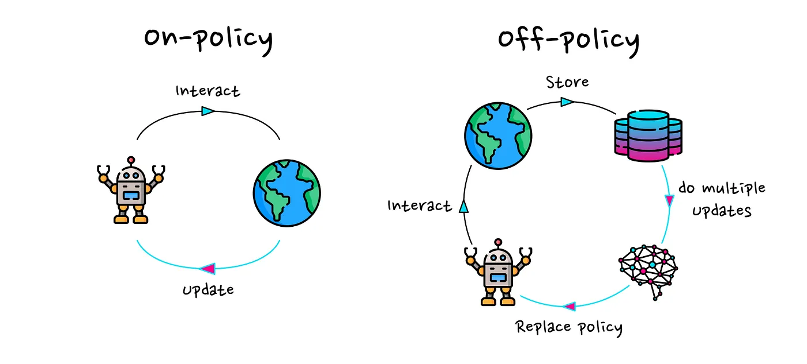
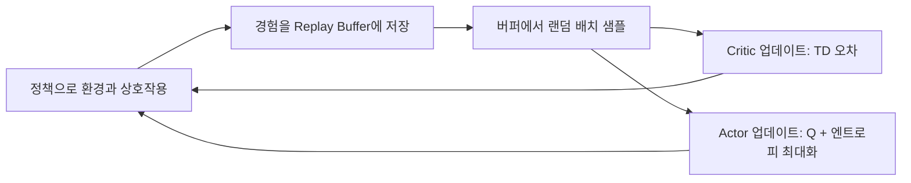

# SAC (Soft Actor-Critic) 이해하기

테트리스 에이전트 학습에 쓸 알고리즘. 왜 이걸 골랐는지, 어떻게 굴러가는지 정리한다.
실제 실행 방법은 [TetrisAgent.md](./TetrisAgent.md)를 보고, 이 문서는 "왜/어떻게"에 집중한다.

---

## 1. On-policy vs Off-policy



RL 학습의 핵심은 **경험(state, action, reward, next state)을 모아서 정책을 개선**하는 것이다.
이 경험을 "누가 만든 걸 쓰느냐"로 두 부류가 갈린다.

| | On-policy | Off-policy |
|---|---|---|
| 학습에 쓰는 경험 | **지금 정책**이 방금 만든 것만 | **과거 정책**이 만든 것도 재사용 |
| 경험 저장 | 쓰고 버림 | **Replay Buffer**에 쌓아두고 반복 사용 |
| 샘플 효율 | 낮음 (환경 상호작용 많이 필요) | 높음 (한 경험을 여러 번 우려먹음) |
| 대표 알고리즘 | PPO, A2C | **SAC**, DQN, DDPG |

**On-policy(PPO)의 문제:** 정책을 조금이라도 업데이트하면 이전 경험은 "낡은 정책이 만든 것"이 되어 버려야 한다.
매 업데이트마다 환경에서 새로 굴려 데이터를 모아야 하니, 환경 한 스텝이 비쌀수록 손해다.

**Off-policy(SAC)의 이점:** Replay Buffer에 경험을 쌓아두고, 학습할 때 **랜덤하게 꺼내 재사용**한다.
"환경에서 한 번 겪은 일"을 정책이 바뀐 뒤에도 여러 번 학습에 쓸 수 있어 **샘플 효율(sample efficiency)이 높다**.

> 직관: On-policy는 "방금 친 문제만 채점", Off-policy는 "오답 노트를 계속 다시 봄".

---

## 2. SAC는 어떻게 작동하나

SAC는 **Actor-Critic** 구조 위에 두 가지 아이디어를 얹은 off-policy 알고리즘이다.

### (a) Actor-Critic
- **Actor(정책 π):** 상태를 받아 어떤 행동을 할지 결정한다.
- **Critic(Q함수):** "이 상태에서 이 행동을 하면 앞으로 받을 총 보상이 얼마?"를 추정한다.
- Actor는 Critic이 "좋다"고 평가하는 행동을 더 자주 하도록 학습한다.

### (b) Maximum Entropy — SAC의 정체성
보통 RL은 "누적 보상 최대화"만 목표로 한다. SAC는 목표를 하나 더 얹는다:

```
목표 = 누적 보상  +  α · 엔트로피(정책의 무작위성)
```

즉 **보상을 최대화하되, 가능한 한 다양하게(랜덤하게) 행동하라**는 것.
- **탐험(exploration)이 자동으로 유지**된다. 한 가지 전략에 성급하게 갇히지 않는다.
- α(temperature)가 "보상 vs 탐험"의 균형을 정한다. SAC는 이 **α도 자동으로 학습**해서, 학습 초반엔 많이 탐험하고 후반엔 점점 결정적으로 수렴한다.

### (c) 안정화 장치
- **Twin Q (Q함수 2개):** Q값을 과대평가하는 고질병을 막으려고 둘 중 작은 값을 쓴다.
- **Target Network:** 학습 목표가 흔들리지 않게 천천히 따라오는 사본 네트워크를 둔다.

### 전체 루프


---

## 3. ML-Agents에서 SAC 쓰기

ML-Agents는 PPO와 SAC를 기본 제공한다. **trainer 설정에서 타입만 바꾸면** 된다.

```yaml
behaviors:
  Tetris:
    trainer_type: sac          # ← 이 한 줄이 SAC 선택
    hyperparameters:
      batch_size: 256          # 버퍼에서 한 번에 꺼내는 경험 수
      buffer_size: 500000      # Replay Buffer 크기 (off-policy의 핵심)
      learning_rate: 3.0e-4
      init_entcoef: 1.0        # 초기 엔트로피 계수 α (탐험 강도)
    network_settings:
      hidden_units: 256
      num_layers: 2
    max_steps: 5000000
```

키 포인트:
- `buffer_size`가 크다 = 과거 경험을 오래 보관 = off-policy 재사용의 이점을 키운다 (PPO엔 없는 항목).
- `init_entcoef`가 2절의 α. 크면 초반 탐험이 강해진다.
- **이산 행동(Discrete Action)과 Action Masking을 지원**한다. 테트리스처럼 "불가능한 배치"를 막아야 하는 문제에 필수. (자세한 관측/행동 설계는 TetrisAgent.md 참고)

---

## 4. 왜 테트리스에 SAC인가

테트리스 배치 문제의 성격과 SAC의 강점이 맞물린다.

1. **샘플 효율이 중요하다.**
   한 판을 굴리는 건 비싸다(렌더/물리/스텝). 한 번 겪은 경험을 Replay Buffer로 재사용하는 off-policy가 유리하다.

2. **탐험이 오래 필요하다.**
   테트리스는 "구멍 안 만들기 / 높이 낮게 / 줄 지우기"처럼 장기 전략을 찾아야 한다.
   초반에 그럴듯한 한 패턴에 갇히면 지역 최적에 빠진다. **Maximum Entropy가 탐험을 자연스럽게 오래 유지**해 준다.

3. **보상이 드문드문(sparse) 하다.**
   줄을 지워야 큰 보상이 온다. 그 전까지는 신호가 약하다.
   버퍼 재사용 + 엔트로피 탐험 조합이 이런 희소 보상 환경에서 특히 강하다.

4. **이산 행동 + 마스킹을 그대로 지원한다.**
   행동 = (열 × 회전) 이산 40가지, 그중 불가능한 배치는 마스킹. SAC가 이걸 지원하므로 별도 트릭이 필요 없다.

> 요약: **비싼 환경(효율 필요) + 장기 전략(탐험 필요) + 희소 보상 + 이산 행동** → SAC가 잘 맞는 문제.

---

## 한 줄 정리

SAC = **경험을 재사용하는(off-policy)** + **일부러 다양하게 행동하며 탐험하는(max entropy)** Actor-Critic.
비싼 Unity 환경에서 장기 전략을 찾아야 하는 테트리스에 잘 맞는다.

### 더 볼 것
- [SAC 논문 (Haarnoja et al., 2018)](https://arxiv.org/abs/1801.01290)
- [ML-Agents Training-SAC 문서](https://unity-technologies.github.io/ml-agents/Training-Configuration-File/)
