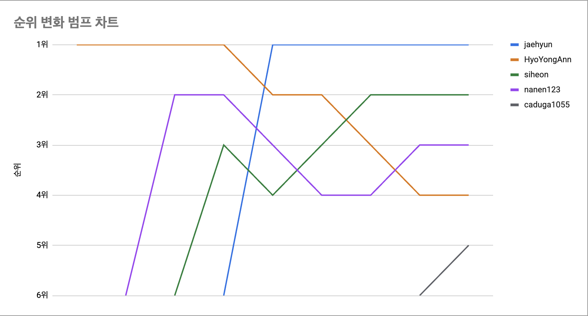
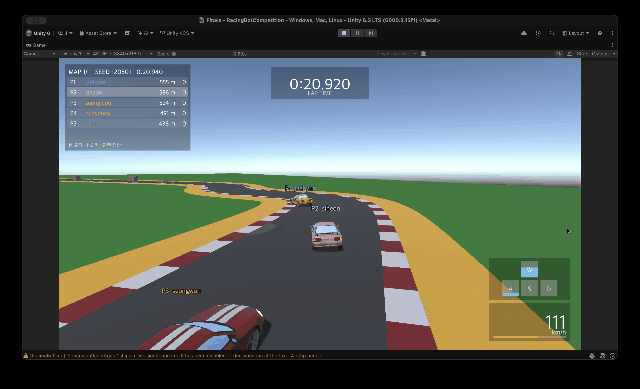
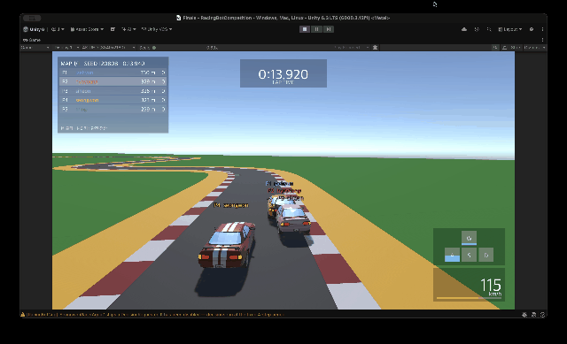
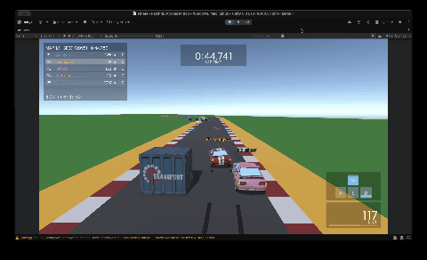
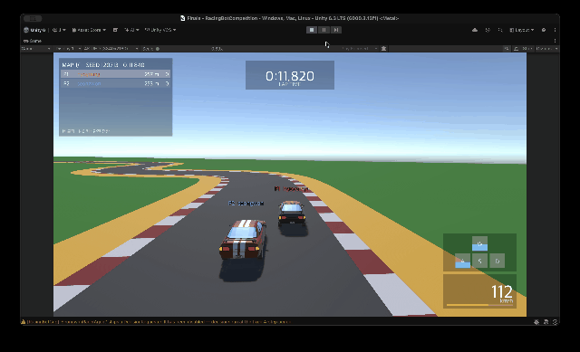
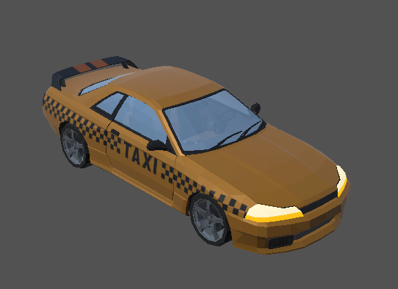
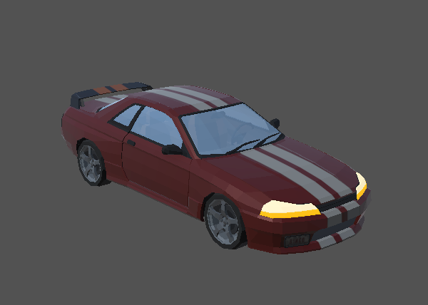
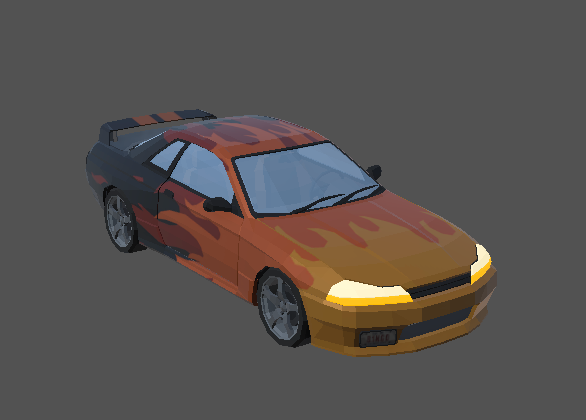

# RacingBot Cup — 대회 결과

## 1. 실시간 리더보드

대회 기간(약 3주) 동안 참가자가 로컬에서 평가를 돌리고 [결과 제출] 버튼으로 올린 기록입니다. 시드 세트는 모두 `public-v5`.

| 순위 | ID | 총점 | 완주율 | 점수 표준편차 |
|---:|---|---:|---:|---:|
| 🥇 1 | [jaehyun](https://github.com/linklingj) (최재현) | **1.4458** | 1 | 0.1958 |
| 🥈 2 | [siheon](https://github.com/ksihun) (권시헌) | 1.4069 | 1 | 0.2086 |
| 🥉 3 | [nanen123](https://github.com/nanen123) (이성원) | 1.3235 | 1 | 0.0354 |
| 4 | [HyoYongAnn](https://github.com/HyoYongAnn) (안효용) | 1.2094 | 1 | 0.0262 |
| 5 | [caduga1055](https://github.com/Cleanhea) (홍민기) | 1.142 | 1 | 0.0487 |

### 순위 변화 (범프 차트)

리더보드 순위가 바뀔 때마다 찍은 순서입니다.

---

## 2. 본선 (2026-09-11)

랜덤 시드 맵 3개에서 1~3차전을 치르고 점수를 합산해 최종 순위를 정했습니다. 모두 동시에 달렸고, 학습 환경과 똑같이 차끼리 부딪히지 않게 했습니다.

### 1차전 — seed `120501`

짧지만 장애물 구간이 있는 어려운 트랙.

| 결과 | 참가자 |
|---|---|
| 🥇 1위 | 최재현 |
| 2위 | 안효용 |
| 3위 | 홍민기 |
| 리타이어 | 권시헌, 이성원 — 둘 다 장애물 상자에 부딪힘 |

### 2차전 — seed `120808`

초반 S자 구간을 빼면 어렵지 않은, 코너링 실력으로 갈리는 트랙.

| 결과 | 참가자 |
|---|---|
| 🥇 1위 | 이성원 |
| 2위 | 권시헌 |
| 3위 | 안효용 |
| 4위 | 홍민기 |
| 리타이어 | 최재현 — S자 구간에서 무리하게 안쪽으로 질러가다 잔디에서 멈춤 |

### 3차전 — seed `120951`

1800m가 넘는 긴 장애물 트랙.

| 결과 | 참가자 |
|---|---|
| 🥇 1위 | 최재현 |
| 2위 | 이성원 |
| 3위 | 안효용 |
| 4위 | 홍민기 |
| 리타이어 | 권시헌 - 나무 토막에 막혀 리타이어 |

### 2위 결정전 — seed `120713`

이성원·안효용이 공동 2위(10점)라서 한 판 더 달렸습니다.

- **이성원 승** — 출발은 안효용님이 빨랐지만, 이성원님이 코너 안쪽 라인으로 추월.

---

## 3. 최종 순위

| 순위 | 이름 | 점수 | 상품 |
|---:|---|---:|---|
| 🥇 1 | 최재현 | **12** | - |
| 🥈 2 | 이성원 | 10 | 스팀 상품권 2만원 |
| 🥉 3 | 안효용 | 10 | 스팀 상품권 1만원 |
| 4 | 홍민기 | 7 | |
| 5 | 권시헌 | 4 | |

---

## 4. 순위권 학습 노하우

### 🥇 최재현 — 완주를 먼저 잡고, 그다음 속도

- **완주 먼저**: 처음에 리타이어가 많던 장애물 코스 시드만 골라서, 완주율이 거의 1이 될 때까지 학습.
- **시드별 기록 기준 보상**: 시드마다 걸린 시간을 기록해 두고, 그 기록보다 빠르면 보상을 주고 기록을 갱신. 트랙 길이마다 도착 시간이 크게 달라 보상 크기가 들쭉날쭉한 문제를 없애려는 방법.
- **장기간 학습**: 모두 합쳐 약 40시간. 평균 기록을 41초에서 40초로 줄이는 데만 30시간 넘게 걸림.
- 되돌아보면: 후반 학습에서 완주율보다 속도에 치우친 탓에 2차전에서 리타이어한 것으로 봄.

### 🥈 이성원 — 보상을 잘게 나눠서 설계

- **트랙 이탈 벌점을 제곱으로**: 트랙 밖으로 나간 바퀴 수를 제곱해 벌점을 줌. 트랙을 완전히 벗어나는 건 피하면서, 코너를 조금 질러가는 건 봐줌.
- **구간별 속도 벌점**: 직선에서 너무 느리면 벌점, 위험 구간에서 너무 빠르면 벌점. 기준 속도는 학습을 돌려 보면서 직접 정함.
- 결과: 코너 바깥 → 안쪽 → 바깥으로 빠지는 라인(아웃-인-아웃)을 매우 잘 탐.

### 🥉 안효용 — 보상은 결과에만

- 에이전트의 행동을 보상으로 하나하나 유도하지 않고, **완주 보상과 시간 보상만 크게** 줘서 가장 빠른 길을 스스로 찾게 함.
- 결과: 본선 내내 한 번도 리타이어하지 않고 안정적으로 달림.
